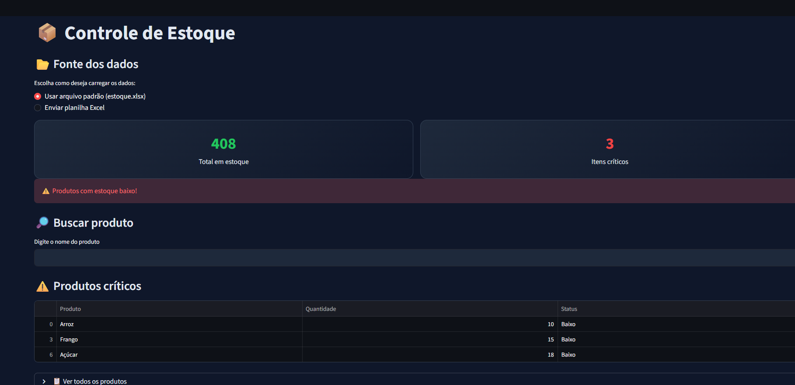

# 📦 Dashboard de Controle de Estoque

Projeto desenvolvido em Python com o objetivo de automatizar a análise de estoque a partir de planilhas Excel.

## 🚀 Funcionalidades

- Leitura automática de planilhas Excel
- Classificação de estoque (Baixo, Médio e Alto)
- Identificação de produtos críticos
- Busca dinâmica de produtos
- Dashboard interativo

## 🛠️ Tecnologias

- Python
- Pandas
- Streamlit

## 📊 Sobre o projeto

Este projeto foi criado com foco em resolver um problema real: o controle de estoque de forma simples e eficiente.

O sistema permite visualizar rapidamente quais produtos precisam de reposição, ajudando na tomada de decisão.

## 📸 Preview



## ▶️ Como executar

```bash
pip install -r requirements.txt
streamlit run app.py# dashboard-estoque-python

